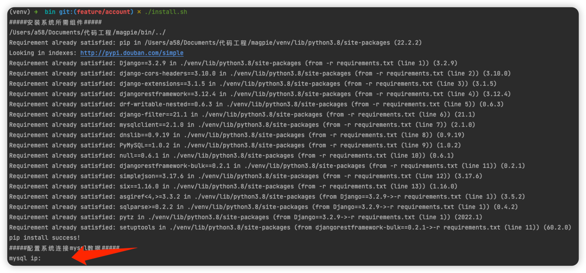
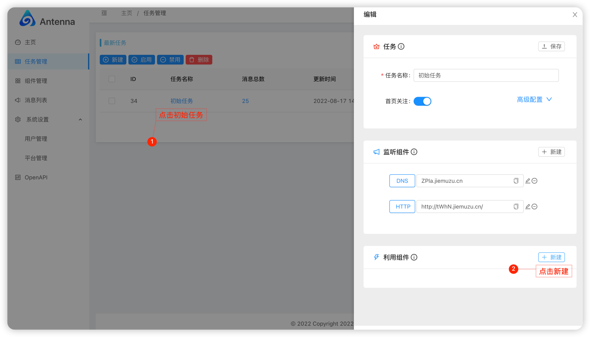

# Antenna
## 免责声明
1. 本工具仅面向 合法授权 的企业安全建设行为与个人学习行为，如您需要测试本工具的可用性，请自行搭建靶机环境。
2. 如您在使用本工具的过程中存在任何非法行为，您需自行承担相应后果，我们将不承担任何法律及连带责任。
在安装并使用本工具前，请您 务必审慎阅读、充分理解各条款内容限制、免责条款或者其他涉及您重大权益的条款可能会以 加粗、加下划线等形式提示您重点注意。
除非您已充分阅读、完全理解并接受本协议所有条款，否则，请您不要安装并使用本工具。您的使用行为或者您以其他任何明示或者默示方式表示接受本协议的，即视为您已阅读并同意本协议的约束。
## Antenna简介
Antenna是58同城安全团队打造的一款辅助安全从业人员辅助验证网络中多种漏洞是否存在以及可利用性的工具。其基于带外应用安全测试(OAST)通过任务的形式，将不同漏洞场景检测能力通过插件的形式进行集合，通过与目标进行out-bind的数据通信方式进行辅助检测。
## Antenna的目标
我们绝不仅仅只是将Antenna做成一款只能监听DNS、HTTP等协议来简单判断无回显类型漏洞的工具，我们的目标是尝试在良好使用体验的基础上支持高度灵活的自定义组件能力，满足用户通过Antenna探索并实现各种应用安全漏洞场景的辅助检测。尽可能得实现通过Antenna这款产品降低各种安全漏洞场景的检测成本。
## 部署教程
部署前所需

1、一台公网服务器

2、一个申请好的域名
### 源码部署

源码部署服务器系统推荐使用centos，如需部署其他服务器系统需修改项目中install.sh 中部分安装命令

下载源码
```
git clone https://github.com/WUBA/Antenna.git
```
进入项目运行install 脚本
```
cd ./Antenna/bin 
chmod +x ./*
./install.sh
```
脚本运行按照提示填写连接数据库配置与域名信息

填写示例
```angular2html
mysql ip: 127.0.0.1
mysql port: 3306
mysql username: root
mysql password: 123456
plateform_domain: test.com
```
系统会自动创建初始管理员账户antenna@58.com 密码：antenna@58.com
访问安装系统服务器8000端口，可访问系统后台并访问


### Docker部署

## 使用教程
### Antenna初始配置教程
#### 平台设置
##### 授权码设置及QQ邮箱授权码申请教程
#### 协议设置
##### 域名配置及阿里云dns服务修改教程


### Antenna产品基础使用教程
#### 消息监听与漏洞利用组件
演示平台：x.x.x.x

漏洞靶场：x.x.x.x

Antenna 初始开放HTTP、DNS、RMI、LDAP 四个监听组件以及XSS、XXE、HTTP_CUSTOM(SSRF/JSONP)等多个漏洞场景利用组件
其组件最终以链接等方式进行生成。
平台通过任务的形式对拥有各种能力的链接进行区分,新用户默认创建初始任务与支持的所有监听组件实例
##### 新建组件实例(利用链接)
以创建XSS漏洞场景利用链接为例，首先点击初始任务查看任务详情，然后点击新建开始选择漏洞场景类型

选择XSS组件，平台初始支持get_cookie(获取cookie)与get_page_sources(获取源码)两种利用方式，可进行多选并点击确定


点击确定后便会生成支持获取cookie与源码xss漏洞的利用payload
##### 组件实例(利用链接)的使用

#### Open API


## Antenna组件使用教程
### 自定义组件编写教程


## 联系我们
如果对Antenna有任何建设性意见或 BUG 反馈，欢迎大家提 issue
进交流群或有问题想与技术同学沟通，请联系并添加运营微信号：bios_000
Antenna用户交流群：
